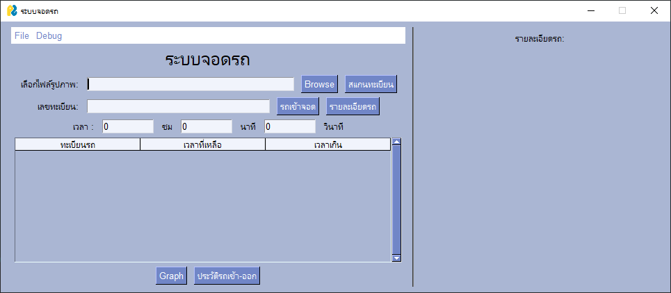

### Full Document :[VehicleEntrySystem Manual](https://panoramic-file-85b.notion.site/VehicleEntrySystem-Manual-5c05c39cfb6d406da09a17f1a4c27a61?pvs=74) (Thai Language)

## Used :
- Make sure you have installed python 3.12 up
- clone this repository `git clone https://github.com/carrot1358/VehicleEntrySystem.git`
- run `pip install -r requirements.txt` to install all dependencies
- run `python main.py` to start the program
## Preview:
